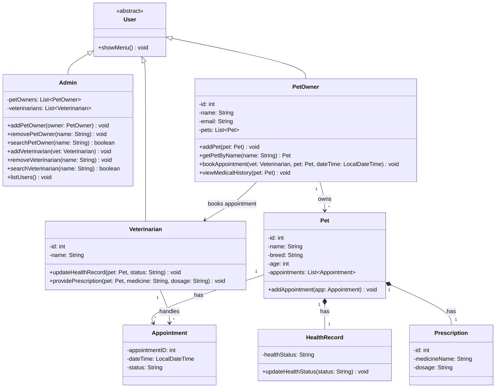

# 🐾 PetClinicSystem 

A Java-based console application for managing a pet clinic system.  
The system supports multiple roles including **Admin**, **Pet Owner**, and **Veterinarian**, with features such as appointment booking, medical records management, and file-based data persistence.

---

## 🚀 Features

### 👨‍💼 Admin
- Add / Remove Pet Owners
- Add / Remove Veterinarians
- Search for Pet Owners & Veterinarians
- View all users

### 🐶 Pet Owner
- Add pets
- Book appointments with veterinarians
- View pet medical history
- View prescriptions

### 🩺 Veterinarian
- Update pet health records
- Provide prescriptions
- View pet details and history

---

## 🏗️ Project Structure

```
PetClinicSystem/
│
├── src/
│   └── petclinicsystem/
│       ├── app/          # Main application (entry point)
│       ├── model/        # Core data classes (OOP)
│       ├── service/      # Business logic
│       ├── repository/   # File handling (persistence)
│       └── util/         # Helper classes
│
├── nbproject/            # NetBeans configuration
├── README.md
└── .gitignore
```

---

## 🧠 System Design

The project follows a **layered architecture**:

- **Model Layer** → Represents entities (Pet, Owner, Vet, etc.)
- **Service Layer** → Contains business logic
- **Repository Layer** → Handles file storage
- **App Layer** → User interface (console menus)

---

## 💾 Data Persistence

The system uses **text files** to store data:

- `petOwners.txt`
- `veterinarians.txt`
- `pets.txt`

Data is automatically:
- Loaded at startup
- Saved on exit

---

## ▶️ How to Run

1. Open the project in **Apache NetBeans**
2. Run: `petclinicsystem.app.PetClinicSystem`
3. Follow the menu in the console

---

## 🛠️ Technologies Used

- Java (OOP)
- File I/O (BufferedReader / BufferedWriter)
- Apache NetBeans IDE

---

## 📊 UML Class Diagram



📌 This diagram represents the system architecture following OOP and layered design principles.

---

## 📌 Future Improvements

- Add GUI (JavaFX / Swing)
- Integrate database (MySQL)
- Implement authentication system
- Add appointment conflict detection

---

## 👨‍💻 Author

**Karim Amr**
